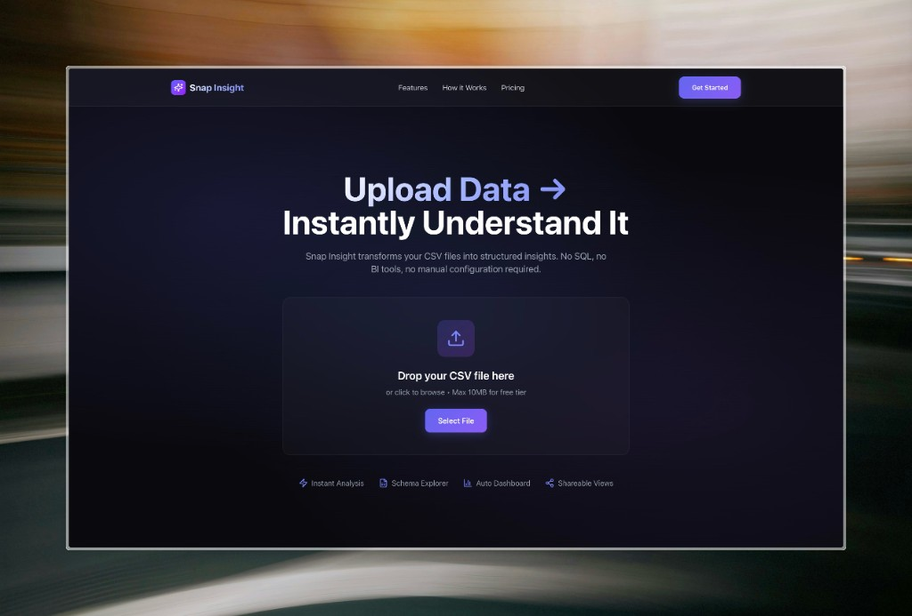

# Snap Insight

> **Upload data → instantly understand structure, quality, and insights.**



**Snap Insight** is a Dataset Intelligence SaaS that transforms raw CSV files into structured insights with zero configuration. Upload your file and receive an automatic schema explorer and data dashboard within seconds.

Built during the **48-Hour Vibe Coding Hackathon** from [DataExpert.io](https://dataexpert.io) in collaboration with [sylph.ai](https://sylph.ai)'s **ADAL**.

---

## The Problem

Users frequently receive CSV datasets but must inspect columns manually, guess data types, write queries, and configure dashboards before they can extract insights, creating significant onboarding friction. 
Snap Insight compresses this entire process into a single interaction.

---

## Features

| Feature | Description |
|--------|-------------|
| **Upload & Profile** | Drag-and-drop CSV upload with automatic type inference and column profiling |
| **Schema Explorer** | Auto-generated dataset documentation: inferred types, null counts, unique values, min/max, sample values |
| **Auto Dashboard** | Deterministic chart generation: line charts (datetime+numeric), bar charts (categorical), histograms (numeric) |
| **Shareable Reports** | Public read-only links for dashboards—no auth required for viewers |
| **Billing Tiers** | Free (10MB, 100k rows) and Pro (35MB, 300k rows) with Stripe subscription |
| **Auth** | Supabase OAuth (GitHub/Google) for authenticated sessions |

---

## Tech Stack

- **Frontend:** Next.js 15, React 19, Tailwind 4
- **Backend:** Next.js API Routes, Supabase (Auth, Postgres, Storage)
- **Billing:** Stripe Checkout + Webhooks

---

## Quick Start

```bash
cd webapp
npm install
cp .env.example .env.local   # Set Supabase & Stripe keys
npm run dev                 # http://localhost:3000
```

See `webapp/SETUP.md` for detailed setup (Supabase bucket, migrations, env vars).

---

## Live Demo

**https://snap-insight.vercel.app**

- **Try sample CSV** on the landing page for instant demo—no file needed.
- **Working share link** (sample data): [https://snap-insight.vercel.app/report/00000000-0000-4000-8000-000000000001](https://snap-insight.vercel.app/report/00000000-0000-4000-8000-000000000001)

Requires running `supabase/migrations/00002_seed_demo_dataset.sql` in Supabase SQL Editor (after `00001_initial_schema.sql`).

---

## Cron / Cleanup (Disabled on Hobby)

The dataset cleanup job (`/api/cron/cleanup`) is **not scheduled** on Vercel Hobby: Hobby allows only one cron run per day, while cleanup needs to run every 15 minutes. The route is still available—call it manually or use an external cron service (e.g. [cron-job.org](https://cron-job.org)) pointing at `https://your-domain.vercel.app/api/cron/cleanup` with `Authorization: Bearer <CRON_SECRET>`. Upgrade to Vercel Pro to use built-in crons.

---

## Submission Checklist

- [ ] **GitHub repo set to public** (Settings → General → Visibility)
- [ ] App tree and routes in `webapp/routes.md` match imports

## Demo Readiness Checklist

- [ ] Supabase project created; `.env.local` configured
- [ ] `uploads` bucket exists; RLS allows authenticated uploads
- [ ] Migrations run: `00001_initial_schema.sql`, then `00002_seed_demo_dataset.sql` (for share link)
- [ ] GitHub OAuth configured in Supabase (optional: Google)
- [ ] Stripe Price ID and Webhook set for Pro tier
- [ ] Sample CSV at `/sample.csv` for zero-friction demo

---

## License

Private. Built for the DataExpert.io 48-Hour Vibe Coding Hackathon with sylph.ai's ADAL.
